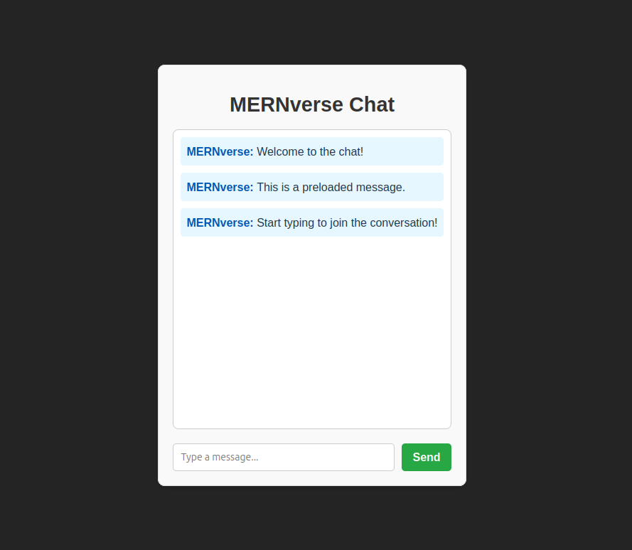

# MERNverse

A lightweight real-time chat application built with the MERN Stack (MongoDB, Express.js, React, Node.js), featuring Socket.IO for real-time communication and Dockerized for easy deployment.

> [!WARNING]  
> This project was created for **educational purposes only** and is **not intended for production use**.

<details>
  <summary>Page Sample</summary>
  <br>
  <div align="center">
    
</details>

---

## Getting Started

### Start the Application

Run the following command to build and start the containers:  

```bash
docker compose up -d
```

This will: 

1. Build the Docker images for the FastAPI and Streamlit services.  
2. Start the containers and serve the application.  

---

## Features

- **Frontend with React and Vite**:  
  The frontend is built with React, using Vite as the build tool for fast development and optimized production builds.

- **Swagger API Documentation**:  
  Swagger UI is available at **/api-docs** to explore and test available API routes.

- **Nginx for Serving Frontend and Proxying Requests**:  
  **Nginx** is used to serve the built frontend files and proxy API and WebSocket requests to the backend.

- **Input Validation with Joi**:
  All incoming chat messages are validated using Joi to ensure data integrity and prevent malformed inputs or potential security issues.

---

## Prerequisites

Before you start, ensure the following tools are installed on your system:

- Docker  
- Docker Compose  

---

## Access the Application

- **React Frontend (served by Nginx)**:  
  Visit <http://localhost> to interact with the chat interface.

- **Swagger API Documentation**:  
  Visit <http://localhost/api-docs> to explore and test the available API routes.

---

## Development Workflow

### Live Reloading

Both the **React frontend (via Vite)** and the **Express backend** support hot reloading out of the box when running in development mode.

To enable live reloading during development:

- **Frontend (Vite)**:  
   When running locally (`npm run dev`), Vite provides instant hot module replacement (HMR) for a smooth development experience.

   If you're working inside a container, you can expose port `5173` and mount your local code into the container for real-time updates.

- **Backend (Express)**:  
   Use `nodemon` to enable automatic restarts on code changes. This can be done locally or within the container.

### Using Docker for Live Development

If you want hot reloading **inside Docker containers**, consider the following:

- Mount your local frontend and backend code as volumes.
- For Express, use a development Dockerfile or override `CMD` with `nodemon`.
- For React, expose Vite’s dev server port (typically `5173`) and run `npm run dev` inside the container.

### Stopping the Application

To stop the application, press `Ctrl+C` or run the following command:  

```bash
docker compose down
```

This will stop and remove the containers, but the built images will remain.  


---

## Directory Structure

The project structure is as follows:  

```shell
.  
mernverse/
├── backend/                          # Express backend service
│   ├── config/
│   │   └── db.js                     # MongoDB connection setup
│   ├── Dockerfile                    # Dockerfile to build backend image
│   ├── index.js                      # Main entry point for Express + Socket.IO
│   ├── models/
│   │   └── Message.js                # Mongoose schema for storing chat messages
│   ├── mongo-init/
│   │   └── init.js                   # Initialization script for MongoDB (optional setup)
│   ├── package.json                  # Backend dependencies and scripts
│   ├── routes/
│   │   ├── health.js                 # Health check route for service status
│   │   └── messages.js               # API route for fetching/storing messages
│   └── test/
│       └── sample.test.js            # Sample backend test (can be expanded)
├── frontend/                         # React frontend (built with Vite)
│   ├── Dockerfile                    # Multi-stage Dockerfile for build + Nginx
│   ├── eslint.config.js              # ESLint config for code quality (optional)
│   ├── index.html                    # HTML template used by Vite
│   ├── mernverse.conf                # Nginx config to serve frontend and proxy API/WebSocket
│   ├── package.json                  # Frontend dependencies and scripts
│   ├── public/
│   │   └── vite.svg                  # Static assets for public use
│   ├── src/                          # React source files
│   │   ├── api/
│   │   │   └── messages.js           # API utility for fetching messages
│   │   ├── App.css                   # Component-specific styles (optional, minor)
│   │   ├── App.jsx                   # Main React component, handles chat logic
│   │   ├── assets/
│   │   │   └── react.svg             # Example asset used in the UI
│   │   ├── components/
│   │   │   └── ChatWindow.jsx        # Component for displaying and interacting with chat
│   │   ├── index.css                 # Global styles
│   │   ├── main.jsx                  # React entry point (attaches App to the DOM)
│   │   └── services/
│   │       └── socket.js             # Socket.IO client setup for real-time updates
│   └── vite.config.js                # Vite configuration for build optimization
├── docker-compose.yml                # Docker Compose configuration for all services
└── README.md                         # Project documentation and setup instructions
```

---

## Troubleshooting

- Ensure Docker and Docker Compose are installed and running on your system.  
- Verify that the required port 80 is not in use by other applications.  

---

## License

This project is licensed under the MIT License. See the LICENSE file for details.
